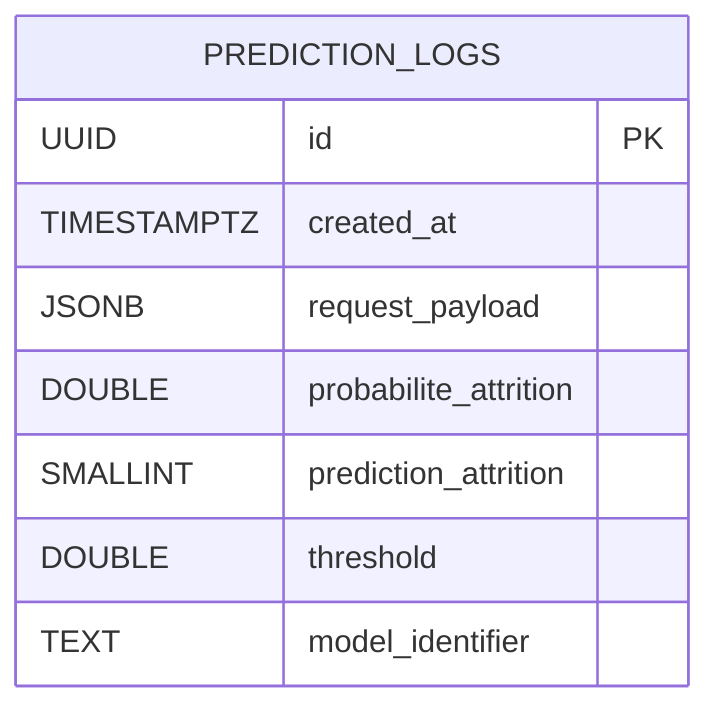

# Base de donnees PostgreSQL

## Objectif

La base PostgreSQL stocke la tracabilite des predictions exposees par l'API :

- le payload d'entree recu par `/predict` ;
- la probabilite renvoyee par le modele ;
- la decision binaire finale ;
- le seuil de decision ;
- l'identifiant de l'artefact modele utilise.

Cette structure sert a la fois :

- au logging applicatif ;
- a l'audit des predictions ;
- a la preparation d'usages analytiques ou d'un tableau de bord ulterieur.

## Creation de la base

Deux options sont fournies dans le depot :

- `uv run python scripts/create_db.py` : cree la base si besoin puis applique les
  migrations Alembic ;
- `sql/create_prediction_logs.sql` : version SQL brute de la table principale.

Si le port local `5432` est deja pris, le demarrage Docker peut etre surcharge avec
`POSTGRES_PORT=55433`.

## Structure de la table



Contraintes principales :

- `id` est la cle primaire ;
- `request_payload` est conserve en `JSONB` ;
- `prediction_attrition` est force a `0` ou `1`.

## Jeu d'exemples et seed

Le depot fournit trois formes complementaires du dataset d'exemples :

- `references/prediction_logs_examples.csv` : dataset versionne de reference ;
- `sql/example_prediction_logs.sql` : exemple d'insertion SQL manuelle ;
- `scripts/seed_prediction_logs.py` : script Python de seed pour inserer le CSV dans une
  base existante.

Commande recommandee :

```bash
uv run python scripts/seed_prediction_logs.py --truncate
```

Le seed est idempotent sur les memes identifiants : un relancement met a jour les lignes
au lieu de dupliquer les enregistrements.

## Verification de l'insertion

Exemple de verification apres seed :

```bash
uv run python - <<'PY'
from sqlalchemy import create_engine, text
from openclassrooms_projet5.config import get_database_url

engine = create_engine(get_database_url(), future=True)
with engine.connect() as connection:
    result = connection.execute(
        text(
            "SELECT id, prediction_attrition, model_identifier "
            "FROM prediction_logs ORDER BY created_at"
        )
    )
    for row in result.mappings():
        print(dict(row))
engine.dispose()
PY
```

## Processus de stockage

Le stockage suit ce flux :

1. validation du payload par Pydantic ;
2. calcul de la prediction par le pipeline modele ;
3. verification de disponibilite de PostgreSQL si la base est configuree ;
4. insertion dans `prediction_logs` via le service de persistence ;
5. retour de la reponse HTTP au client.

Quand PostgreSQL est configure, l'API refuse maintenant une prediction si la persistance
n'est pas disponible. Cela evite de perdre silencieusement la trace des appels.

## Besoins analytiques couverts

La table permet deja de repondre a plusieurs besoins :

- comptage des predictions par jour ;
- suivi du taux d'attrition predit ;
- analyse de la distribution des scores renvoyes ;
- comparaison entre artefacts modele ;
- audit d'un payload et de la sortie associee.

Le projet ne fournit pas de dashboard dans ce depot, mais la structure de donnees est
concue pour rendre un tel usage simple a brancher ensuite.
