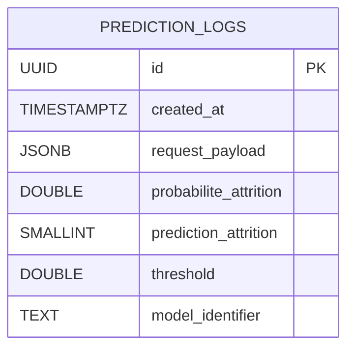

# Base de donnees PostgreSQL

## Objectif

La base PostgreSQL stocke la tracabilite des predictions exposees par l'API :

- le payload d'entree recu par `/predict` ;
- la probabilite renvoyee par le modele ;
- la decision binaire finale ;
- le seuil de decision ;
- l'identifiant de l'artefact modele utilise.

## Creation de la base

Deux options sont fournies dans le depot :

- `uv run python scripts/create_db.py` : cree la base si besoin puis applique les migrations Alembic ;
- `sql/create_prediction_logs.sql` : version SQL brute de la table principale.

## Structure de la table

## Exemples

- `references/prediction_logs_examples.csv` : exemples d'entrees/export pour la soutenance ;
- `sql/example_prediction_logs.sql` : exemple d'insertion SQL manuelle.

## Notes d'implementation

- Le schema applicatif est versionne via Alembic dans `alembic/versions/`.
- Quand PostgreSQL est configure, l'API refuse maintenant une prediction si la persistance n'est pas disponible.
- Si PostgreSQL n'est pas configure du tout, l'API peut encore servir de POC local, mais la version cible pour la soutenance est l'execution avec base active.
